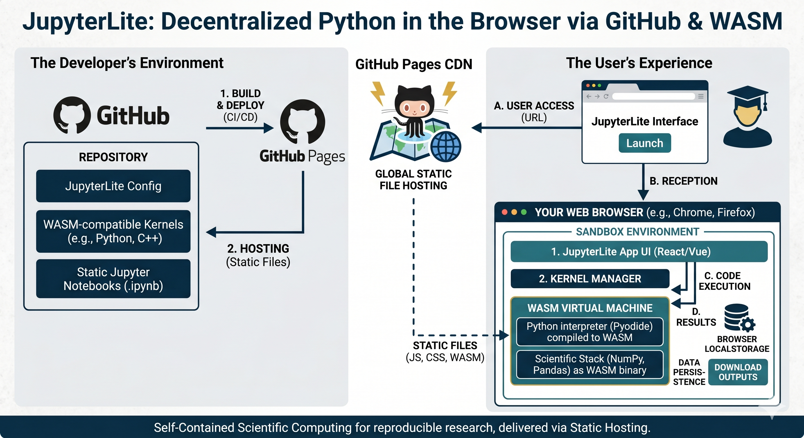

# Running code in the browser

The Jupyter notebooks run in the browser using some impressive technologies to bridge the gap between desktop software and web architecture. 

* WebAssembly (**Wasm**), is a high-performance, low-level virtual CPU embedded within modern browsers, enabling them to execute compiled binary code at near-native speed alongside traditional JavaScript. 
* **Emscripten** is a compiler toolchain; it translates the underlying C source code of the Python interpreter into Wasm binaries while simultaneously generating a JavaScript wrapper that emulates a local operating system—mimicking file systems and memory management within the browser's security sandbox. You can also use it to compile C/C++ extensions used in Python code.
* **Pyodide** is a specialized distribution that delivers the actual, Wasm-compiled CPython runtime directly to the browser, complete with a robust data bridge to JavaScript and a pre-compiled ecosystem of heavy scientific packages like NumPy, SciPy, Matplotlib, OpenCV and Pandas, ultimately allowing complete Python code execution entirely within the local browser runtime.

When you load a JupyterLite URL in your browser, a lot happens under the hood: an entire data science environment is bootstrapped and executed entirely inside your browser tab -- something that traditionally required heavy server-side infrastructure.
Because there is no remote Python server (like a traditional Jupyter Notebook or JupyterLab setup), your browser does all the heavy lifting. Here is the step-by-step breakdown of exactly what happens from the moment you hit Enter.

* Step 1: Fetching the Static Assets (The Shell)
The URL you visit points to a website hosting static files (often deployed on GitHub Pages, GitLab Pages, or a simple web server).
Your browser makes a standard HTTP request and downloads the core frontend files: `index.html`, JavaScript bundles, CSS stylesheets, and configuration files (like `jupyter-lite.json`).
The browser renders the user interface. At this point, you see the familiar JupyterLab or Jupyter Notebook layout, but you cannot run any code yet. The "brains" of the operation are still being assembled.

* Step 2: Registering the Service Worker (The Virtual Server)
This is a crucial architectural step. JupyterLite registers a Service Worker in your browser.
The Service Worker acts as a built-in, local proxy server sitting between the Jupyter user interface and the network.
When the frontend UI tries to make "server" requests (e.g., saving a file, fetching a list of notebooks, or checking kernel status), the Service Worker intercepts these requests.
Instead of sending them out to the internet, it handles them locally using browser APIs. For example, when you "save" a notebook, the Service Worker intercepts the save request and writes the file to your browser's local storage (typically IndexedDB).

* Step 3: Initializing the WebAssembly Kernel (The Brains)
When you open a notebook, JupyterLite needs a programming language environment (a kernel) to run your code.
If you open a Python notebook, the browser downloads a compilation of Python compiled to Wasm -- most commonly Pyodide (or a lightweight alternative like xeus-python). This is a substantial download (often several megabytes) containing the full Python interpreter.
The browser's WebAssembly engine compiles and executes this binary code at near-native speed -- even though it is an interpretter running an interpretter.
This creates a fully functioning Python environment isolated inside a Web Worker (a background browser thread). Running the kernel in a Web Worker ensures that heavy code computations do not freeze or crash the main user interface.

* Step 4: Loading the Filesystem and Environment
Once the kernel is running, it sets up its local environment:
  * Virtual Filesystem: Pyodide sets up a virtual, in-memory filesystem. JupyterLite syncs this virtual filesystem with your browser's IndexedDB so that your notebooks and data scripts persist even if you refresh the page.
  * Standard Library Setup: The Python interpreter prepares its core modules.

* Step 5: Executing Code (The Loop)
  * When you click "Run" on a notebook cell containing Python code, the execution loop is entirely local:
    * UI to Worker: The Jupyter frontend sends the raw code string across the internal bridge to the Web Worker where Pyodide is running.
    * In-Browser Execution: The Wasm-compiled Python interpreter executes the code. It uses your machine's CPU cycles directly within the browser sandbox.
    * Package Management (On Demand): If your code requires external packages like micropip to install libraries (e.g., matplotlib or numpy), Pyodide fetches 
  Wasm-compatible wheels (pure Python or specifically compiled C-extensions) directly from a Content Delivery Network (CDN) like PyPI or jsDelivr, loading them dynamically into the environment.
  * Returning Results: The execution results, errors, or rich outputs (like a plotted chart or HTML table) are bundled into standard Jupyter messaging protocol format and sent back to the main UI thread.
  * Rendering: The browser UI receives the data and renders your output on the screen.

Unlike a normal webpage that constantly talks to a cloud server, a running JupyterLite tab is self-contained:
  * Compute (CPU/RAM): Your local device.
  * Storage: Your browser's IndexedDB.
  * Network: Intercepted and faked locally by the Service Worker.

# Some resources

- [JupyterLite: Jupyter ❤️ WebAssembly ❤️ Python](https://blog.jupyter.org/jupyterlite-jupyter-%EF%B8%8F-webassembly-%EF%B8%8F-python-f6e2e41ab3fa) a readable article on Medium (free to read)
-  presentation at PyCon Berline